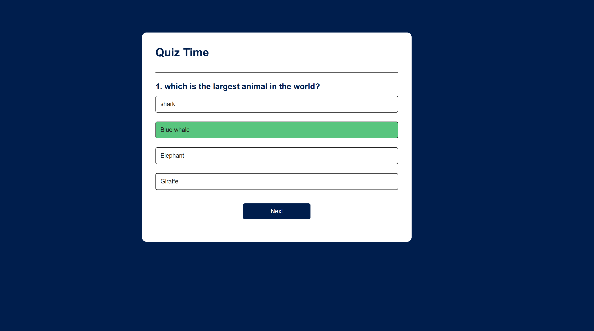

# 🧠 Quiz App

A simple and interactive Quiz Application built with **HTML**, **CSS**, and **JavaScript**. Test your knowledge with multiple-choice questions, get instant feedback, and see your final score at the end.

---

## 📸 Screenshots

### Quiz Question Screen

<p align="center">
  
</p>

### Final Score Screen

<p align="center">
  
</p>

---

## 🚀 Features

- Multiple-choice questions
- Instant feedback on answers
- Score tracking and display at the end
- Responsive design for all devices
- Easy to add or update questions in the script

---

## 📂 Folder Structure
```
Quiz_App/
├── index.html
├── style.css
├── script.js
├── Images/
│ ├── start-screen.png
│ ├── question-screen.png
│ └── final-score.png
└── README.md
```

---

## 📦 How to Run Locally

```
1. Clone the repository  
   git clone https://github.com/rashi311/Quiz_App.git
   cd Quiz_App
2.Open index.html in your browser.   
